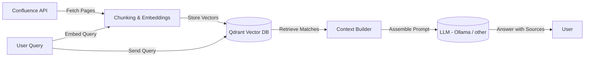

# Confluence Semantic Search with LLM
## 📌 Project Overview

This project provides a semantic search pipeline over Confluence documentation using a vector database (Qdrant) and a large language model (LLM).

The system:

Indexes Confluence pages into vector embeddings.

Performs semantic search to find the most relevant chunks.

Optionally fetches adjacent chunks for better context continuity.

Uses the retrieved context to build a prompt for an LLM (via Ollama
) to answer user questions.

This is intended as an open project, designed for teams or individuals who want to query large Confluence spaces with AI, while retaining control over their data.

## ✨ Capabilities

- 🔎 Semantic search over Confluence content using Qdrant.

- 🧩 Context enrichment: fetches adjacent chunks around semantic hits for more coherent answers.

- 🤖 LLM integration: constructs a contextualized prompt for Ollama or any local/remote LLM backend.

- 🔗 Source tracking: results include Confluence titles, links, and positions.

- 🛠️ Extensible design: add new embeddings, vector DBs, or LLMs with minimal changes.

## 🔧 Project Architecture

## 🚀 Installation Guide
### 1. Prerequisites

- Docker (for Qdrant container).

- Python 3.9+ (for the app code).

- curl (for installing Ollama).

### 2. Run Qdrant with Docker

Pull and run Qdrant locally:

```
docker pull qdrant/qdrant
docker run -p 6333:6333 qdrant/qdrant
```


Qdrant will be available at http://localhost:6333.

### 3. Install Ollama

Install the Ollama runtime:

```
curl -fsSL https://ollama.ai/install.sh | sh
```

You can verify installation with:

```
ollama run llama2
```

### 4. Configure Environment Variables

Set the following environment variables globally (e.g. in ~/.bashrc or ~/.zshrc):

```
export CONFLUENCE_BASE_URL="https://your-domain.atlassian.net/wiki"
export CONFLUENCE_API_TOKEN="your-api-token"
export CONFLUENCE_ROOT_PAGE_ID="123456789"
export SPACE_KEY="ABC"
```

Reload your shell after editing:

```
source ~/.bashrc   # or ~/.zshrc
```

### 5. Install Python Dependencies

Create a virtual environment and install requirements:

```
python -m venv venv
source venv/bin/activate
pip install -r requirements.txt
```

## 📖 Usage

#### Run the main_indexor.py script to populate Qdrant with Confluence chunks.
#### Use the main_rag.py script to query your documentation.

## Changelog
See [CHANGELOG.md](./CHANGELOG.md) for details on releases and updates.

## 🤝 Contributing

Contributions are welcome! Please open an issue or PR.
