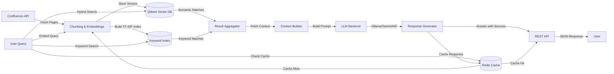

# Confluence Semantic Search with LLM
## 📌 Project Overview
This project provides a production-ready semantic search and Retrieval-Augmented Generation (RAG) pipeline over Confluence documentation using a vector database (Qdrant), Redis caching, and multiple LLM backends.

The system:

- Indexes Confluence pages into vector embeddings based on configurable sources defined in rag_config.yaml.​

- Performs hybrid search combining semantic vector search and keyword-based TF-IDF search for improved retrieval accuracy.​

- Implements Redis-based caching for embeddings, queries, and LLM responses to dramatically improve performance and reduce API costs.​

- Fetches adjacent chunks for better context continuity and coherent answers.​

- Supports multiple LLM backends: Ollama (local), Gemini API (cloud), and Hugging Face Transformers.​

- Provides a REST API with FastAPI for easy integration with other services.​

- Includes full CI/CD automation with GitHub Actions for testing, security scanning, and Docker image builds.​

This is intended as an open project, designed for teams or individuals who want to query large Confluence spaces with AI, while retaining control over their data.

## ✨ Capabilities
- 🔎 Hybrid search combining semantic (Qdrant) and keyword-based (TF-IDF) search for superior retrieval accuracy.​

- ⚡ Redis caching layer for embeddings, queries, and LLM responses to dramatically improve response times and reduce costs.​

- 🧩 Context enrichment: fetches adjacent chunks around semantic hits for more coherent answers.​

- 🤖 Multi-backend LLM support: Ollama (Phi-3.5, Llama 3.2, Qwen 2.5, Gemma2), Gemini API (Flash, Pro), and Hugging Face Transformers.​

- 🔗 Source tracking: results include Confluence titles, links, page hierarchy, and timestamps.​

- ⚙️ Configurable indexing: define what to index via rag_config.yaml with support for multiple Confluence spaces and page hierarchies.​

- 🛠️ Extensible design: add new embeddings, vector DBs, or LLMs with minimal changes through adapter pattern.​

- 🐳 Full Docker Compose orchestration with separate GPU and CPU configurations for flexible deployment.​

- 🔄 CI/CD automation: GitHub Actions workflows for automated testing, security scanning, and Docker image publishing.​

- 📊 REST API: FastAPI-based endpoints for querying, searching, and monitoring system health.​

## 🔧 Project Architecture


## 🚀 Installation Guide
__1. Prerequisites__
- Docker and Docker Compose (for containerized deployment)​

- Python 3.10+ (for local development)​

- Git (for cloning the repository)​

- NVIDIA Container Toolkit (optional, for GPU acceleration)

__2. Quick Start with Docker Compose__
Clone the repository and navigate to the project directory:

```bash
git clone <repository-url>
cd <project-directory>
```
Create and edit .env with your credentials:

```bash
CONFLUENCE_TOKEN="your-confluence-api-token"
GEMINI_API_KEY="your-gemini-api-key"
```
Configure your documentation sources in config/rag_config.yaml:

```yaml
sources:
  - name: "Confluence Docs"
    type: "confluence"
    base_url: "https://confluence.com"
    root_ids: ["123456789"]
    api_token: "${CONFLUENCE_TOKEN}"
    sync_interval: "12h"
```
Build and start all services using the Makefile:

```bash
make build
make up
```
This will start four services:

- __rag-qdrant__: Vector database for storing embeddings (port 6333).

- __rag-cache__: Redis cache for query results and embeddings (port 6379).

- __rag-indexer__: Background service that indexes Confluence pages based on rag_config.yaml.

- __rag-app__: Main API service for querying the indexed documentation and ask the RAG (port 8000).

__3. GPU Support__
```bash
# Install NVIDIA Container Toolkit first
# See: https://docs.nvidia.com/datacenter/cloud-native/container-toolkit/install-guide.html

# Start services with GPU support
make up-gpu
```
The GPU configuration uses docker-compose.gpu.yml which enables GPU passthrough for the indexer and app services.

__4. Makefile Commands__
The project includes a Makefile for convenient Docker Compose operations:

```bash
# Build Docker images
make build

# Start all services (CPU)
make up

# Start all services (GPU)
make up-gpu

# Start with custom config (CPU)
CONFIG=./config/custom_config.yaml make up

# Stop all services
make down

# View logs
make logs

# Run only the indexer (CPU)
make indexer

# Run only the indexer (GPU)
make indexer-gpu

# Run only the API app (CPU)
make app

# Run only the API app (GPU)
make app-gpu

# Show all available commands
make help
```
__5. Local Development Setup__
For local development without Docker:

### Install Qdrant:

```bash
docker pull qdrant/qdrant
docker run -p 6333:6333 qdrant/qdrant
```
### Install Redis:

```bash
docker pull redis:7-alpine
docker run -p 6379:6379 redis:7-alpine
```
### Install Ollama (for local LLM backend):

```bash
curl -fsSL https://ollama.ai/install.sh | sh
ollama run llama2
```
### Create virtual environment and install dependencies:

```bash
python -m venv venv
source venv/bin/activate  # On Windows: venv\Scripts\activate
pip install -r requirements.txt
```
## ⚙️ Configuration
### rag_config.yaml
The rag_config.yaml file is the central configuration for defining what documentation to index and how to process it. Key sections include:​

- Confluence Sources: Define which Confluence spaces and pages to index, with granular control over page hierarchies.​

- Indexing Parameters: Configure chunk size, overlap, and batch processing settings for optimal embedding generation.​ (🔴 TBD)

- Embedding Models: Specify which embedding model to use for vector generation.​ (🔴 TBD)

- Cache Settings: Configure Redis cache behavior including TTL and enabled features.​ (🔴 TBD)

See the example config/rag_config.yaml above for the complete structure.​

__Key features:__

- Multiple sources: Index from multiple Confluence spaces or page hierarchies​

- Environment variable expansion: Use ${VAR_NAME} to reference environment variables​

- Sync intervals: Control how often each source is re-indexed

__LLM Backend Configuration__

The project supports three LLM backends configured in llm/config.py, model selection is made on the RAG API call to ask (*/v1/rag/ask*):

```json
{
        "phi3.5_q4_K_M": {
            "model_backend": "ollama",
            "name": "phi3.5:3.8b-mini-instruct-q4_K_M",
            "size": "2.2GB",
            "description": "Microsoft Phi-3.5 - Excellent for RAG, very fast",
            "ram_needed": "4GB",
            "best_for": "General Q&A, great instruction following"
        },
        "phi3.5_q8_0": {
            "model_backend": "ollama",
            "name": "phi3.5:3.8b-mini-instruct-q8_0",
            "size": "4.1GB",
            "description": "Microsoft Phi-3.5 Q8_0 - Highest performance, heavy resource usage",
            "ram_needed": "8GB",
            "best_for": "Maximum quality responses, complex reasoning, long documents"
        },
        "phi3.5_q6_K":{
            "model_backend": "ollama",
            "name": "phi3.5:3.8b-mini-instruct-q6_K",
            "size": "3.1GB",
            "description": "Microsoft Phi-3.5 Q6_K - Enhanced performance, more memory",
            "ram_needed": "6GB",
            "best_for": "Longer context tasks, instruction-following with higher accuracy"
        },
        "llama3.2": {
            "model_backend": "ollama",
            "name": "llama3.2:3b-instruct-q4_K_M",
            "size": "1.9GB",
            "description": "Meta Llama 3.2 - Great balance of size/quality",
            "ram_needed": "3GB",
            "best_for": "Conversational, good reasoning"
        },
        "qwen2.5": {
            "model_backend": "ollama",
            "name": "qwen2.5:3b-instruct-q4_K_M",
            "size": "1.9GB",
            "description": "Alibaba Qwen2.5 - Excellent for technical content",
            "ram_needed": "3GB",
            "best_for": "Technical docs, coding, structured responses"
        },
        "pleias-rag-350m": {
            "model_backend": "transformers",
            "name": "PleIAs/Pleias-RAG-350M",
            "size": "",
            "description": "",
            "ram_needed": "",
            "best_for": ""
        },
        "mistral-7B-instruct": {
            "model_backend": "transformers",
            "name": "mistralai/Mistral-7B-Instruct-v0.3",
            "size": "",
            "description": "",
            "ram_needed": "",
            "best_for": ""
        },
        "gemma2": {
            "model_backend": "ollama",
            "name": "gemma2:2b-instruct-q4_K_M",
            "size": "1.6GB",
            "description": "Google Gemma2 - Very small but capable",
            "ram_needed": "2GB",
            "best_for": "Resource-constrained environments"
        },
        "flash": {
            "model_backend": "gemini",
            "name": "gemini-2.5-flash",
            "context_window": "1,048,576 tokens",
            "latency_priority": "Low Latency / High Throughput",
            "description": "The best price-performance model. Fast, cost-effective, and capable of handling complex RAG with a 1M token context window.",
            "best_for": "Large-scale RAG, high-volume tasks, agentic workflows"
        },
        "pro": {
            "model_backend": "gemini",
            "name": "gemini-2.5-pro",
            "context_window": "1,048,576 tokens",
            "latency_priority": "Standard Latency / High Quality",
            "description": "Google's most advanced reasoning model, featuring the highest quality output and complex problem-solving capabilities.",
            "best_for": "Complex reasoning, coding, deep analysis, highest quality RAG"
        },
        "flash_lite": {
            "model_backend": "gemini",
            "name": "gemini-2.5-flash-lite",
            "context_window": "1,048,576 tokens",
            "latency_priority": "Very Low Latency / Most Cost-Effective",
            "description": "Optimized for maximum speed and cost-efficiency. A lightweight model suitable for high-frequency or cost-sensitive tasks.",
            "best_for": "High throughput, cost-conscious applications, simple Q&A"
        },
        "flash_1_0": {
            "model_backend": "gemini",
            "name": "gemini-1.0-flash",
            "context_window": "1,048,576 tokens",
            "latency_priority": "Standard Latency / Legacy Option",
            "description": "A previous generation model that offers a stable, general-purpose API option.",
            "best_for": "Legacy compatibility, general tasks"
        }
    }
```

### Secret Management
This project uses a centralized secret manager to securely retrieve credentials and configuration. Supported backends include GCP Secret Manager, AWS Secrets Manager, and Azure Key Vault.​

__Using get_secrets in Code__

If a secret is not found in the secret manager, get_secrets will fallback to environment variables with the same name.

### Local Development with .env File
For local testing or development, define a .env file at the root of the project:

```bash
CONFLUENCE_TOKEN="your-api-token"
GEMINI_API_KEY="your-gemini-key"
```
The project uses python-dotenv to load the .env file automatically:

```python
from dotenv import load_dotenv
import os

load_dotenv()

api_token = os.getenv("CONFLUENCE_TOKEN")
```
### Using Cloud Secret Managers
__GCP Secret Manager:__

```python
CONFLUENCE_API_TOKEN = get_secrets("confluence_api_token", backend="gcp")
```
__AWS Secrets Manager:__

```python
CONFLUENCE_API_TOKEN = get_secrets("confluence_api_token", backend="aws")
```
__Azure Key Vault:__

```python
CONFLUENCE_API_TOKEN = get_secrets("confluence_api_token", backend="azure")
```
This approach ensures your credentials remain secure while still allowing local overrides via environment variables or a .env file.​

## 📖 Usage
### Running the Indexer
The indexer runs automatically as a Docker service when you use make up. It continuously monitors the configured Confluence spaces and indexes new or updated pages based on rag_config.yaml.​

To run only the indexer:

```bash
make indexer
```
For manual indexing in local development:

```bash
python -m main_indexor
```

The indexer performs the following operations:

- Fetches pages from configured Confluence sources​

- Chunks documents into manageable segments with overlap​

- Generates embeddings using sentence transformers​

- Builds keyword index using TF-IDF for hybrid search​

- Stores vectors in Qdrant with metadata (title, URL, hierarchy, timestamps)

### Querying the RAG System
Once the services are running, you can query your documentation through the API:

Query RAG:
```bash
curl -X POST http://localhost:8000/v1/rag/ask \
  -H "Content-Type: application/json" \
  -d '{
    "question": "How do I configure authentication?",
    "model": "flash", # For gemini 2.5 flash
    "llm_top_k": 5,
    "cache": true
  }'
```
Response
```bash
{
  "answer": "To configure authentication, you need to...",
  "sources": [
    {
      "title": "Authentication Guide",
      "link": "https://confluence.com/display/DOC/Auth",
      "score": 0.92,
      "last_updated": "2025-09-25T10:01:47.000Z"
    }
  ]
}
```
Semantic Search Only
```bash
curl -X POST http://localhost:8000/v1/rag/search \
  -H "Content-Type: application/json" \
  -d '{
    "question": "authentication configuration",
    "max_sources": 10,
    "max_results": 5
  }'
```
Vector DB stats
```bash
curl http://localhost:8000/v1/rag/stats
```
Response
```json
[
    {
        "name": "default_collection",
        "status": "green",
        "optimizer_status": "ok",
        "points_count": 2331,
        "vectors_count": null,
        "segments_count": 8,
        "indexed_vectors_count": 0,
        "config": {
            "params": {
                "vectors": {
                    "size": 768,
                    "distance": "Cosine",
                    "hnsw_config": null,
                    "quantization_config": null,
                    "on_disk": null,
                    "datatype": null,
                    "multivector_config": null
                },
                "shard_number": 1,
                "replication_factor": 1,
                "write_consistency_factor": 1
            },
            "hnsw_config": {
                "m": 16,
                "ef_construct": 100,
                "full_scan_threshold": 10000,
                "max_indexing_threads": 0,
                "on_disk": false,
                "payload_m": null
            },
            "optimizer_config": {
                "deleted_threshold": 0.2,
                "vacuum_min_vector_number": 1000,
                "default_segment_number": 0,
                "max_segment_size": null,
                "memmap_threshold": null,
                "indexing_threshold": 10000,
                "flush_interval_sec": 5,
                "max_optimization_threads": null
            },
            "wal_config": {
                "wal_capacity_mb": 32,
                "wal_segments_ahead": 0
            }
        },
        "payload_schema": {}
    }
]
```
Or use the main RAG script to ask in command line (for tests):

```bash
python -m main_rag
```
### Redis Cache Benefits
The Redis cache provides several performance improvements:​

- Embedding Cache: Stores computed embeddings to avoid recomputation for similar queries.​  (🔴 TBD)

- Query Cache: Caches search results for frequently asked questions, reducing vector database queries.​

- Semantic Cache: Uses vector similarity to match queries with similar meanings, serving pre-approved answers instantly.​  (🔴 TBD)

- Response Cache: Stores LLM-generated responses to reduce API calls and costs by up to 80%.​ 

- Cache hit rates and performance metrics can be monitored through application logs.​ (🔴 TBD)

## 🐳 Docker Services
The Docker Compose setup includes four services:​

__rag-app__
- Purpose: Main API service exposing the RAG query endpoints​

- Port: 8000

- Health Check: HTTP GET on /health

- Dependencies: rag-qdrant, rag-cache

__rag-indexer__
- Purpose: Background service that continuously indexes Confluence documentation​

- Configuration: Reads from rag_config.yaml

- Restart Policy: Always (restarts if crashes)

- Dependencies: rag-qdrant, rag-cache

__rag-qdrant__
- Purpose: Qdrant vector database for storing and querying embeddings​

- Port: 6333

- Volume: qdrant_storage for persistent data

- Health Check: HTTP GET on port 6333

__rag-cache__
- Purpose: Redis cache for query results, embeddings, and LLM responses​

- Port: 6379

- Volume: redis_data with AOF persistence

- Memory Policy: allkeys-lru eviction when memory limit reached

All services are configured with health checks, automatic restarts, and persistent volumes.

### Docker Images
Pre-built images are available on GitHub Container Registry:

- ghcr.io/flavorflav-github/rag-app:latest - Latest GPU-enabled build​

- ghcr.io/flavorflav-github/rag-app:cpu - CPU-only build​

## 🔄 CI/CD Pipeline
The project includes three GitHub Actions workflows:​

### 1. Docker Build and Publish (docker.yml)
- Triggers: Push to main branch

- Actions:

  - Builds multi-platform Docker images (linux/amd64, linux/arm64)

  - Pushes to GitHub Container Registry

  - Tags with commit SHA and latest

- Artifacts: Published Docker images

### 2. Unit Tests (unit-tests.yml)
- Triggers: Push to any branch, Pull requests to main

- Actions:

  - Sets up Python 3.12 environment

  - Installs dependencies

  - Runs pytest with coverage

  - Uploads coverage reports

### 3. CodeQL Security Scanning (codeql.yml)
- Triggers: Pull requests to main

- Actions:

  - Performs static code analysis

  - Scans for security vulnerabilities

  - Checks for code quality issues

- Languages: Python

To enable CI/CD in your fork:

- Enable GitHub Actions in repository settings

- Add GITHUB_TOKEN with packages write permission

- Push to main to trigger Docker build

- Open PR to trigger tests and security scans

## 📊 Monitoring and Maintenance
### Cache Maintenance
Redis is configured with append-only file (AOF) persistence to ensure data durability. The cache automatically manages memory using LRU eviction policies when limits are reached.​

To monitor cache performance :
```bash
# Connect to Redis container
docker exec -it rag-cache redis-cli

# View cache statistics
INFO stats

# View memory usage
INFO memory

# View cache hit rate
INFO stats | grep hits
```
### Qdrant Monitoring
Monitor vector database performance:
```bash
# View collection stats via API
curl http://localhost:8000/v1/rag/stats
```
### Reindexing
To trigger a full reindex after updating rag_config.yaml:​

```bash
make down
# Set OVERRRIDE_INDEXING to true in your env variables
make up
```
For incremental updates, the indexer automatically detects changes in Confluence pages and updates only modified content.​

## 🧪 Testing
The project includes comprehensive unit tests:

```bash
# Run all tests
pytest

# Run with coverage
pytest --cov=. --cov-report=html

# Run specific test file
pytest tests/test_search.py

# Run with verbose output
pytest -v
```
Tests cover:

- Search engine functionality (semantic, keyword, hybrid)​

- RAG Workflow for LLM query answering​

## 📈 Performance Optimization
### Embedding Generation
- Batch processing: Embeddings are generated in batches for efficiency​

- Normalization: Vectors are normalized for cosine similarity​

- GPU acceleration: Use GPU compose for faster embedding generation​

### Indexing Strategy
- Concurrent processing: Multiple Confluence pages processed simultaneously​

- Incremental updates: Only modified pages are re-indexed​

- Chunk optimization: Configurable chunk size and overlap for best retrieval​

### Query Performance
- Hybrid search: Combines semantic and keyword search for better accuracy​

- Result caching: Frequently asked questions served from Redis​

- Context fetching: Adjacent chunks loaded only when needed


## Changelog
See CHANGELOG.md for details on releases and updates.

## 🤝 Contributing
We welcome contributions! If you have suggestions for new features, bug fixes, or improvements:

- Fork the repository.

- Create a new feature branch (git checkout -b feature/AmazingFeature).

- Commit your changes (git commit -m 'Add AmazingFeature').

- Push to the branch (git push origin feature/AmazingFeature).

- Open a Pull Request.

Please ensure your code adheres to Python best practices, includes type hints, and passes any existing tests.​

__*Developed by Yassine/@FlavorFlav-github*__
