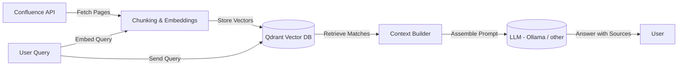

# Confluence Semantic Search with LLM
## 📌 Project Overview

This project provides a semantic search pipeline over Confluence documentation using a vector database (Qdrant) and a large language model (LLM).

The system:

- Indexes Confluence pages into vector embeddings.

- Performs semantic search to find the most relevant chunks.

- Optionally fetches adjacent chunks for better context continuity.

- Uses the retrieved context to build a prompt for an LLM (via Ollama
) to answer user questions.

This is intended as an open project, designed for teams or individuals who want to query large Confluence spaces with AI, while retaining control over their data.

## ✨ Capabilities

- 🔎 Semantic search over Confluence content using Qdrant.

- 🧩 Context enrichment: fetches adjacent chunks around semantic hits for more coherent answers.

- 🤖 LLM integration: constructs a contextualized prompt for Ollama or any local/remote LLM backend.

- 🔗 Source tracking: results include Confluence titles, links, and positions.

- 🛠️ Extensible design: add new embeddings, vector DBs, or LLMs with minimal changes.

## 🔧 Project Architecture

## 🚀 Installation Guide
### 1. Prerequisites

- Docker (for Qdrant container).

- Python 3.9+ (for the app code).

- curl (for installing Ollama).

### 2. Run Qdrant with Docker

Pull and run Qdrant locally:

```
docker pull qdrant/qdrant
docker run -p 6333:6333 qdrant/qdrant
```


Qdrant will be available at http://localhost:6333.

### 3. Install Ollama

Install the Ollama runtime:

```
curl -fsSL https://ollama.ai/install.sh | sh
```

You can verify installation with:

```
ollama run llama2
```

### 4. Configure Secrets

This project uses a centralized secret manager to securely retrieve credentials and configuration. Supported backends include GCP Secret Manager, AWS Secrets Manager, and Azure Key Vault.

Instead of hardcoding credentials, the project provides a generic function get_secrets to fetch secrets safely.

#### 4.1 Using get_secrets in Code
```python
from config.secrets import get_secrets

# Retrieve your secrets by name/key

CONFLUENCE_BASE_URL = get_secrets("confluence_base_url")
CONFLUENCE_API_TOKEN = get_secrets("confluence_api_token")
CONFLUENCE_ROOT_PAGE_ID = get_secrets("confluence_root_page_id")
SPACE_KEY = get_secrets("space_key")
```

> If a secret is not found in the secret manager, get_secrets can fallback to environment variables with the same name.

#### 4.2 Local Development with .env File

For local testing or development, you can define a .env file at the root of the project:
```bash
CONFLUENCE_BASE_URL=https://your-domain.atlassian.net/wiki
CONFLUENCE_API_TOKEN=your-api-token
CONFLUENCE_ROOT_PAGE_ID=123456789
SPACE_KEY=ABC
```

The project uses python-dotenv (or similar) to load the .env file automatically:
```python
from dotenv import load_dotenv
import os

load_dotenv()  # Loads variables from .env into environment

# These will now be available as environment variables
base_url = os.getenv("CONFLUENCE_BASE_URL")
api_token = os.getenv("CONFLUENCE_API_TOKEN")
```

get_secrets will automatically use these environment variables if the secret manager cannot provide a value.

#### 4.3 Using Cloud Secret Managers

GCP Secret Manager:
```bash
CONFLUENCE_API_TOKEN = get_secrets("confluence_api_token", backend="gcp")
```

AWS Secrets Manager:
```bash
CONFLUENCE_API_TOKEN = get_secrets("confluence_api_token", backend="aws")
```

Azure Key Vault:
```bash
CONFLUENCE_API_TOKEN = get_secrets("confluence_api_token", backend="azure")
```

The backend argument is optional if you have a default configured in your environment.

This approach ensures your credentials remain secure while still allowing local overrides via environment variables or a .env file.

### 5. Install Python Dependencies

Create a virtual environment and install requirements:

```
python -m venv venv
source venv/bin/activate
pip install -r requirements.txt
```

## 📖 Usage

#### Run the main_indexor.py script to populate Qdrant with Confluence chunks.
#### Use the main_rag.py script to query your documentation.

## Changelog
See [CHANGELOG.md](./CHANGELOG.md) for details on releases and updates.

## 🤝 Contributing

We welcome contributions! If you have suggestions for new features, bug fixes, or improvements to existing channels:

- Fork the repository.

- Create a new feature branch (git checkout -b feature/AmazingFeature).

- Commit your changes (git commit -m 'Add AmazingFeature').

- Push to the branch (git push origin feature/AmazingFeature).

- Open a Pull Request.

Please ensure your code adheres to Python best practices, includes type hints, and passes any existing tests.

**_Developed by Yassine/@FlavorFlav-github_**
