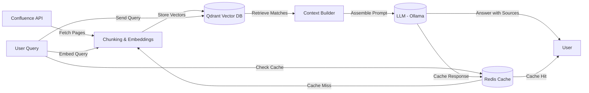

# Confluence Semantic Search with LLM
## 📌 Project Overview
This project provides a semantic search pipeline over Confluence documentation using a vector database (Qdrant), Redis caching, and a large language model (LLM).

The system:

- Indexes Confluence pages into vector embeddings based on configurable sources defined in rag_config.yaml.

- Performs semantic search to find the most relevant chunks with Redis-based caching for improved performance.

- Optionally fetches adjacent chunks for better context continuity.

- Uses the retrieved context to build a prompt for an LLM (via Ollama) to answer user questions.

- Supports semantic caching to reduce latency and LLM costs by storing frequently asked questions.

This is intended as an open project, designed for teams or individuals who want to query large Confluence spaces with AI, while retaining control over their data.

## ✨ Capabilities
- 🔎 Semantic search over Confluence content using Qdrant vector database.

- ⚡ Redis caching layer for embeddings, queries, and LLM responses to dramatically improve response times.

- 🧩 Context enrichment: fetches adjacent chunks around semantic hits for more coherent answers.

- 🤖 LLM integration: constructs a contextualized prompt for Ollama or any local/remote LLM backend.

- 🔗 Source tracking: results include Confluence titles, links, and positions.

- ⚙️ Configurable indexing: define what to index via rag_config.yaml configuration file.​

- 🛠️ Extensible design: add new embeddings, vector DBs, or LLMs with minimal changes.

- 🐳 Full Docker Compose orchestration for production deployment.​

## 🔧 Project Architecture


## 🚀 Installation Guide
__1. Prerequisites__
- Docker and Docker Compose (for containerized deployment).​

- Python 3.10+ (for local development).

- Git (for cloning the repository).

__2. Quick Start with Docker Compose__
Clone the repository and navigate to the project directory:

```bash
git clone <repository-url>
cd <project-directory>
```
Create your .env file from the template:

```bash
cp .env.example .env
```
Edit .env with your credentials:

```bash
CONFLUENCE_TOKEN="your-confluence-api-token"
GEMINI_API_KEY="your-gemini-api-key"

QDRANT_BASE_URL=http://rag-qdrant
QDRANT_PORT=6333
QDRANT_COLLECTION_NAME="rag_collection"

RAG_CONFIG_PATH="/app/config/rag_config.yaml"

REDIS_HOST=rag-cache
REDIS_PORT=6379

RAG_API_PORT=8000
```
Configure your documentation sources in config/rag_config.yaml:

```yaml
sources:
  - name: "Confluence Docs"
    type: "confluence"
    base_url: "https://confluence.com"
    root_ids: ["123456789"]
    api_token: "${CONFLUENCE_TOKEN}"
    sync_interval: "12h"
```
Build and start all services using the Makefile:

```bash
make build
make up
```
This will start four services:

- __rag-qdrant__: Vector database for storing embeddings (port 6333).

- __rag-cache__: Redis cache for query results and embeddings (port 6379).

- __rag-indexer__: Background service that indexes Confluence pages based on rag_config.yaml.

- __rag-app__: Main API service for querying the indexed documentation and ask the RAG (port 8000).

__3. Makefile Commands__
The project includes a Makefile for convenient Docker Compose operations:

```bash
# Build Docker images
make build

# Start all services
make up

# Start with custom config
CONFIG=./config/custom_config.yaml make up

# Stop all services
make down

# View logs
make logs

# Run only the indexer
make indexer

# Run only the API app
make app

# Show all available commands
make help
```
__4. Local Development Setup__
For local development without Docker:

### Install Qdrant:

```bash
docker pull qdrant/qdrant
docker run -p 6333:6333 qdrant/qdrant
```
### Install Redis:

```bash
docker pull redis:7-alpine
docker run -p 6379:6379 redis:7-alpine
```
### Install Ollama:

```bash
curl -fsSL https://ollama.ai/install.sh | sh
ollama run llama2
```
### Create virtual environment and install dependencies:

```bash
python -m venv venv
source venv/bin/activate  # On Windows: venv\Scripts\activate
pip install -r requirements.txt
```
## ⚙️ Configuration
### rag_config.yaml
The rag_config.yaml file is the central configuration for defining what documentation to index and how to process it. Key sections include:​

- Confluence Sources: Define which Confluence spaces and pages to index, with granular control over page hierarchies.​

- Indexing Parameters: Configure chunk size, overlap, and batch processing settings for optimal embedding generation.​ <span style="color:red">(TBD) </span>

- Embedding Models: Specify which embedding model to use for vector generation.​ <span style="color:red">(TBD) </span>

- Cache Settings: Configure Redis cache behavior including TTL and enabled features.​ <span style="color:red">(TBD) </span>

See the example config/rag_config.yaml above for the complete structure.​

### Secret Management
This project uses a centralized secret manager to securely retrieve credentials and configuration. Supported backends include GCP Secret Manager, AWS Secrets Manager, and Azure Key Vault.​

__Using get_secrets in Code__
```python
from config.secrets import get_secrets

CONFLUENCE_BASE_URL = get_secrets("confluence_base_url")
CONFLUENCE_API_TOKEN = get_secrets("confluence_api_token")
CONFLUENCE_ROOT_PAGE_ID = get_secrets("confluence_root_page_id")
SPACE_KEY = get_secrets("space_key")
```
If a secret is not found in the secret manager, get_secrets will fallback to environment variables with the same name.

### Local Development with .env File
For local testing or development, define a .env file at the root of the project:

```bash
CONFLUENCE_TOKEN="your-api-token"
GEMINI_API_KEY="your-gemini-key"

QDRANT_BASE_URL=http://localhost
QDRANT_PORT=6333
QDRANT_COLLECTION_NAME="rag_collection"

RAG_CONFIG_PATH="config/rag_config.yaml"

REDIS_HOST=localhost
REDIS_PORT=6379

RAG_API_PORT=8000
```
The project uses python-dotenv to load the .env file automatically:

```python
from dotenv import load_dotenv
import os

load_dotenv()

base_url = os.getenv("CONFLUENCE_BASE_URL")
api_token = os.getenv("CONFLUENCE_API_TOKEN")
```
### Using Cloud Secret Managers
__GCP Secret Manager:__

```python
CONFLUENCE_API_TOKEN = get_secrets("confluence_api_token", backend="gcp")
```
__AWS Secrets Manager:__

```python
CONFLUENCE_API_TOKEN = get_secrets("confluence_api_token", backend="aws")
```
__Azure Key Vault:__

```python
CONFLUENCE_API_TOKEN = get_secrets("confluence_api_token", backend="azure")
```
This approach ensures your credentials remain secure while still allowing local overrides via environment variables or a .env file.​

## 📖 Usage
### Running the Indexer
The indexer runs automatically as a Docker service when you use make up. It continuously monitors the configured Confluence spaces and indexes new or updated pages based on rag_config.yaml.​

To run only the indexer:

```bash
make indexer
```
For manual indexing in local development:

```bash
python -m main_indexor
```
### Querying the RAG System
Once the services are running, you can query your documentation through the API:

```bash
curl -X POST http://localhost:8000/v1/rag/ask \
  -H "Content-Type: application/json" \
  -d '{"question": "How do I configure authentication?"}'
```
Or use the main RAG script directly:

```bash
python -m main_rag
```
### Redis Cache Benefits
The Redis cache provides several performance improvements:​

- Embedding Cache: Stores computed embeddings to avoid recomputation for similar queries.​  <span style="color:red">(TBD) </span>

- Query Cache: Caches search results for frequently asked questions, reducing vector database queries.​

- Semantic Cache: Uses vector similarity to match queries with similar meanings, serving pre-approved answers instantly.​  <span style="color:red">(TBD) </span>

- Response Cache: Stores LLM-generated responses to reduce API calls and costs by up to 80%.​ 

- Cache hit rates and performance metrics can be monitored through application logs.​ <span style="color:red">(TBD) </span>

## 🐳 Docker Services
The Docker Compose setup includes four services:​

- __rag-app__: Main API service exposing the RAG query endpoint on port 8000.

- __rag-indexer__: Background service that continuously indexes Confluence documentation based on rag_config.yaml.​

- __rag-qdrant__: Qdrant vector database for storing and querying embeddings (port 6333).​

- __rag-cache__: Redis cache for query results, embeddings, and LLM responses (port 6379).​

All services are configured to restart automatically and persist data using Docker volumes.​

## 📊 Monitoring and Maintenance
### Cache Maintenance
Redis is configured with append-only file (AOF) persistence to ensure data durability. The cache automatically manages memory using LRU eviction policies when limits are reached.​

### Reindexing
To trigger a full reindex after updating rag_config.yaml:​

```bash
make down
make up
```
For incremental updates, the indexer automatically detects changes in Confluence pages and updates only modified content.​

### Changelog
See CHANGELOG.md for details on releases and updates.

## 🤝 Contributing
We welcome contributions! If you have suggestions for new features, bug fixes, or improvements:

- Fork the repository.

- Create a new feature branch (git checkout -b feature/AmazingFeature).

- Commit your changes (git commit -m 'Add AmazingFeature').

- Push to the branch (git push origin feature/AmazingFeature).

- Open a Pull Request.

Please ensure your code adheres to Python best practices, includes type hints, and passes any existing tests.​

__*Developed by Yassine/@FlavorFlav-github*__
